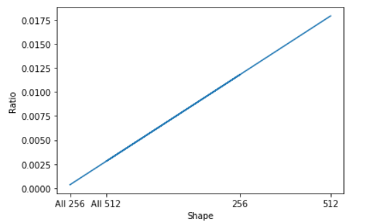
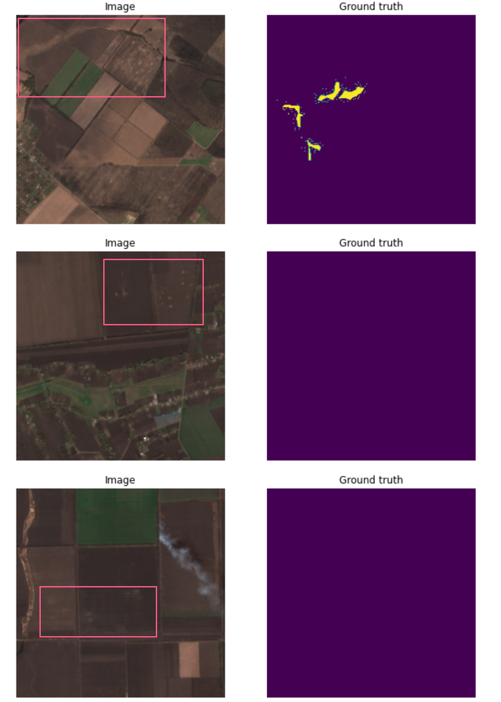
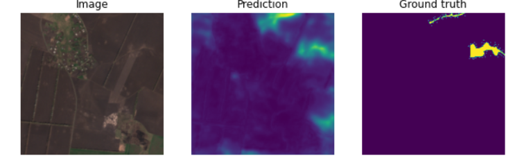
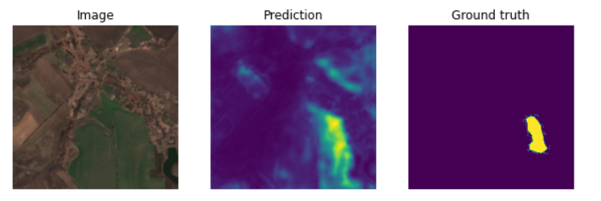
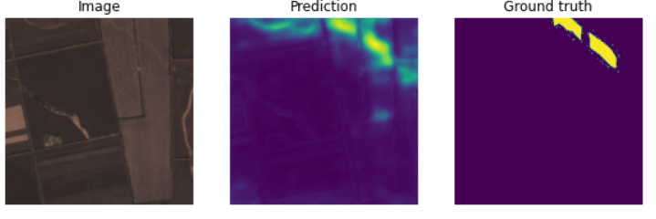

# Erosion-detection 
Abstract: this repo includes a pipeline using tf.keras for training Unet + EfficientNetb0 for the problem of erosion detection. Moreover, weights and trained model are provided. I will use EDA.ipynb as main file in EDA below, all images from output EDA.ipynb.

**Data**: [tap here](https://drive.google.com/drive/folders/1_T-R-FvMaNDeawhHGtUZ6Dc8KF4ERNrn?usp=sharing)

## EDA
Important to notice that we have dataset in .jp2 format (Satellite image), EDA.ipynb contains code using [rasterio](https://rasterio.readthedocs.io/en/latest/)
based on [article](https://medium.datadriveninvestor.com/preparing-aerial-imagery-for-crop-classification-ce05d3601c68).

Aftеr article code execution in EDA.ipynb we got 2 images with shape (3, 10980, 10980) for image and (1, 10980, 10980) for mask.
My suggestion is to simply crop it into images with shape (256, 256) but there is also option for shape (512, 512).

Next, we must predict that cropped mask might contain empty masks, EDA confirms it:
```sh
All 256: 1764. ---> Empty: 1500
All 512:  441. ---> Empty 306
```
As there is not really balanced dataset, let's extract images with non-empty masks using either randomizer or just first 40 images. 40 images because it's 20% of images with non-empty masks. So we have 264 + 40 = 304 (for (256,256) cropping) images.

**But there is still one question not answered: what cropping is better?**

By this reason we will use pixel ratio (mask pixels/ all mask pixels).
Also graph below shows pixel ratio with all images, received during cropping.



Seems like it's better (512,512) cropping, from another hand it's only 141 non-empty masks, therefore was decided to use (256,256) one.

**Influence on model predictions:** at the end of EDA should to say: during training, i noticed that masks actually not cover all erosion:



Now we have 304 images for training, it's quite small number of images, as a solution i suggest to use albumentations to create artificial images, it will be done in training file.

## Results
I tried custom Unet with 2 millon parameters and it works poorly. So i decided to try something bigger after some attempts decided to stop on Unet with EfficientNetB0:

| Architecture | Dice_coef | Input & Mask Resolution | Epochs | Steps_per_epoch | Loss function | Optimizer | Learning scheduler | batch size |
| ------ | ------ | ------ | ------ | ------ | ------ | ------ | ------ |  ------ |
| Unet&EfficientNetB0 | 0.0799 | (256x256) | 50 | 250 | FocalLoss | Adam (lr=1e-3) | ReduceLROnPlateau(factor=0.5, patience=3) | 16 |

Example 1:



Example 2:



Example 3:



## Files description
EDA.ipynb main file for EDA. All images from there.

Task_4.ipynb is a train file, need only data from EDA.ipynb. **Strongly recommend to use this notebook to train model, instead of .py files**

There is also .py files in Py_files

train.py is used to train model

test.py load model and show results

utils.py contains custom losses, metrics and data generator.

Data link at the bottom of readme contains raw Satellite data and model.h5. Use EDA.ipynb to exctract images.

model.h5 is a model for tests, due to custom loss and metrics use test.py or Task_4.ipynb to load it.

## Directory tree
If decided to use .py files directory tree must contain already cropped data from EDA.ipynb
<pre>
 ├── cropped_img (cropped_img_256)
 ├── cropped_mask (cropped_mask_256)
 ├── utils.py
 ├── train.py 
 ├── test.py  
 ├── model.h5
</pre>

**Cropped images must be obtained from EDA.ipynb**

## Solution report
First of all as was showed in EDA, it's needed to get more data (Satellite images), 304 images is really not enought, even with albumentations.
Difference between smaller Unet and Unet with EfficientNetB0 makes me think that it might be better to use Unet with EfficientNetB3 or maybe even B6.
In fact, it makes sense to cluster by the ratio mask pixels / non-mask pixels to get a balanced dataset.
As usual, there is a space for changing learning rate, batch size, steps per epoch or loss fucntion.

Prediction in soil erosion detection depends on factors like the soil type, topography, or climate specifics.
Regular satellite imagery updates provide actual information on the crops. So, with historical data for several years, you can create productivity observations that are generated with cloudless imagery analytics for the selected period.

If we talk not about predictions, would be useful to add a zoning feature: helps understand the required amounts of mineral and organic fertilizers for different areas depending on their individual needs. By using this feature, farmers can divide their fields into several zones based on vegetation indices maps. Each zone on the map shows certain vegetation intensity, assisting in fertilizer distribution for each zone.

